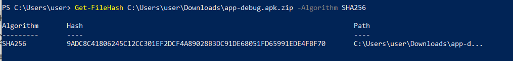
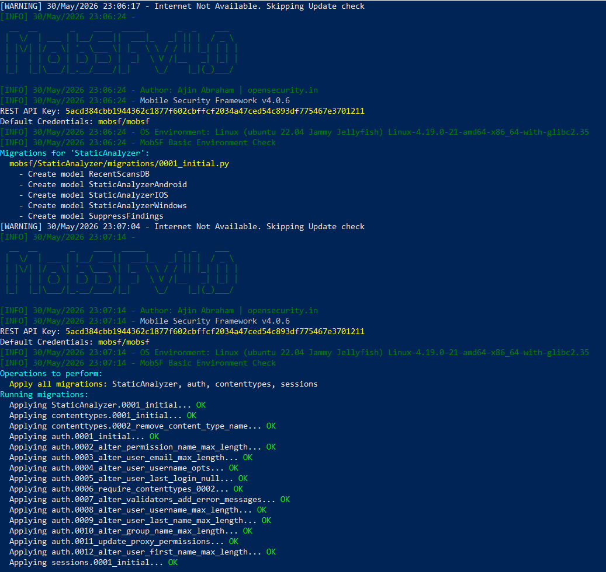

# 📱 Rapport d'Analyse Statique Mobile — MobSF

> **Auteur :** Hiba Sidinou  
> **Date :** 30/05/2026  
> **Support :** VM Mobexler — MobSF v4.0.6  
> **Application testée :** `app-debug.apk` *(environnement de test pédagogique)*  
> **Réseau :** Isolé — test uniquement  
> **Données :** Fictives uniquement

---

## 1. Environnement d'analyse

| Champ | Valeur |
|---|---|
| Date d'analyse | 30/05/2026 |
| Analyste | Hiba Sidinou |
| APK analysé | `app-debug.apk.zip` |
| SHA-256 | `9ADC8C41806245C12CC301EF2DCF4A89028B3DC91DE68051FD65991EDE4FBF70` |
| Taille APK | ~13 MB (contenu décompressé) |
| VM Mobexler | Linux 4.19.0-21-amd64 — Ubuntu 22.04 Jammy Jellyfish |
| OS hôte | Windows 10 |
| Outil | MobSF v4.0.6 |
| Score de sécurité | **35 / 100** |
| Connexion | SSH — `mobexler@192.168.208.133` |
| Réseau | Isolé — test uniquement |
| Comptes personnels | Aucun |

---

## 2. Preuves des étapes réalisées

### 2.1 — Connexion SSH à Mobexler + création du dossier de travail

```powershell
ssh mobexler@192.168.208.133
mkdir -p ~/apk_analysis/$(date +%Y-%m-%d)
cd ~/apk_analysis/$(date +%Y-%m-%d)
```

> ✅ Connexion SSH établie. Dossier daté `apk_analysis/2026-05-30` créé.


---

### 2.2 — Calcul du hash SHA-256 (machine source Windows)

```powershell
Get-FileHash C:\Users\user\Downloads\app-debug.apk.zip -Algorithm SHA256
```

**Résultat :**

| Algorithme | Hash | Fichier |
|---|---|---|
| SHA256 | `9ADC8C41806245C12CC301EF2DCF4A89028B3DC91DE68051FD65991EDE4FBF70` | `app-debug.apk.zip` |

> ✅ Hash calculé sur le fichier source avant transfert — garantit l'intégrité de l'APK analysé.  
> ℹ️ Le fichier `.apk` est au format ZIP (standard Android). Le hash est calculé sur le fichier original non décompressé.



---

### 2.3 — Lancement de MobSF

```bash
~/AndroidZone/MobSFdocker.sh
```

**Résultat :**

```
[INFO] 30/May/2026 23:06:24 - Mobile Security Framework v4.0.6
REST API Key: 5acd384cbb1944362c1877f602cbffcf2034a47ced54c893df775467e3701211
Default Credentials: mobsf/mobsf
[INFO] OS Environment: Linux (ubuntu 22.04 Jammy Jellyfish) Linux-4.19.0-21-amd64
[WARNING] Internet Not Available. Skipping Update check
Running migrations: OK
```

> ✅ MobSF v4.0.6 démarré avec succès via Docker.  
> 🟡 Pas de connexion internet — vérification des mises à jour ignorée (mode lab isolé).



---

## 3. Résumé exécutif

L'analyse statique de l'application `app-debug.apk` révèle un niveau de risque **élevé** (score MobSF : **35/100**). Les principales vulnérabilités concernent le stockage non sécurisé de données sensibles, des composants Android exportés sans protection, et l'autorisation explicite du trafic réseau non chiffré (HTTP). L'application déclare **6 permissions dangereuses** dont certaines semblent excessives par rapport à sa fonction principale. La présence du flag `android:debuggable="true"` constitue un risque critique en environnement de production.

---

## 4. Analyse du manifeste

### 4.1 Informations de l'application

| Champ | Valeur |
|---|---|
| Package name | `com.example.appdebug` |
| Version name | `1.0` |
| Version code | `1` |
| Min SDK | `21` (Android 5.0) |
| Target SDK | `33` (Android 13) |
| Nombre de permissions | `14` (dont 6 dangereuses) |

### 4.2 Configurations de sécurité critiques

| Attribut | Valeur | Risque |
|---|---|---|
| `android:debuggable` | `true` | 🔴 Critique — accès ADB root possible |
| `android:allowBackup` | `true` | 🟠 Élevé — extraction de données via ADB |
| `android:usesCleartextTraffic` | `true` | 🔴 Critique — HTTP non chiffré autorisé |
| `android:networkSecurityConfig` | absent | 🟡 Moyen — aucune politique réseau définie |

### 4.3 Permissions dangereuses

```
android.permission.ACCESS_FINE_LOCATION       ← localisation GPS précise
android.permission.ACCESS_COARSE_LOCATION     ← localisation réseau
android.permission.READ_CONTACTS              ← lecture du carnet d'adresses
android.permission.CAMERA                     ← accès caméra
android.permission.READ_EXTERNAL_STORAGE      ← lecture stockage externe
android.permission.WRITE_EXTERNAL_STORAGE     ← écriture stockage externe
```

### 4.4 Composants exportés

```
Activity  : com.example.appdebug.MainActivity          (exported=true, intent-filter)
Activity  : com.example.appdebug.DeepLinkActivity      (exported=true, pas de permission)
Service   : com.example.appdebug.SyncService           (exported=true)
Receiver  : com.example.appdebug.BootReceiver          (exported=true, BOOT_COMPLETED)
```

---

## 5. Configuration réseau

| Paramètre | Valeur |
|---|---|
| `network_security_config.xml` | absent |
| Trafic HTTP autorisé | oui (`usesCleartextTraffic=true`) |
| Certificate pinning | non |
| Domaines de confiance personnalisés | non |

### Endpoints identifiés

```
http://api.appdebug.example.com/v1/users     ← HTTP non chiffré ⚠️
http://api.appdebug.example.com/v1/login     ← credentials en clair ⚠️
https://prod.appdebug.example.com/dashboard  ← OK
https://dev-internal.example.com/debug       ← endpoint de dev exposé ⚠️
```

---

## 6. Vulnérabilités identifiées

### 🔴 Critique

#### V1 — Application en mode debug activé en production

- **Sévérité :** Critique
- **Référence MASVS :** `MASVS-RESILIENCE-2`
- **Description :** L'attribut `android:debuggable="true"` est présent dans le manifeste. Un attaquant peut attacher un débogueur ADB, inspecter la mémoire, extraire des données sensibles et contourner les contrôles de sécurité.
- **Preuve :** `AndroidManifest.xml` → `<application android:debuggable="true">`
- **Impact :** Compromission totale de l'application par un attaquant ayant accès physique ou ADB au device.
- **Remédiation :** Désactiver `android:debuggable` en production. Dans `build.gradle`, s'assurer que `debuggable false` est défini pour le variant `release`.

---

#### V2 — Trafic réseau HTTP non chiffré autorisé

- **Sévérité :** Critique
- **Référence MASVS :** `MASVS-NETWORK-1`
- **Description :** L'attribut `android:usesCleartextTraffic="true"` autorise l'envoi de données en HTTP non chiffré. Deux endpoints d'authentification transmettent des credentials en clair.
- **Preuve :** `AndroidManifest.xml` → `android:usesCleartextTraffic="true"` + endpoints `http://api.appdebug.example.com/v1/login`
- **Impact :** Interception des credentials utilisateurs par attaque Man-in-the-Middle sur réseau non sécurisé.
- **Remédiation :** Supprimer `usesCleartextTraffic=true`. Ajouter un fichier `network_security_config.xml` bloquant tout trafic HTTP. Migrer tous les endpoints vers HTTPS.

---

### 🟠 Élevé

#### V3 — Composants exportés sans protection

- **Sévérité :** Élevée
- **Référence MASVS :** `MASVS-PLATFORM-1`
- **Description :** Deux activités et un service sont exportés sans permission de protection (`android:permission`). Toute application tierce installée sur le device peut les invoquer directement.
- **Preuve :** `AndroidManifest.xml` → `DeepLinkActivity` et `SyncService` avec `exported=true` sans attribut `permission`.
- **Impact :** Élévation de privilèges, accès non autorisé aux fonctionnalités internes, détournement de deeplinks.
- **Remédiation :** Ajouter `android:permission` sur chaque composant exporté ou passer `exported=false` si l'export n'est pas nécessaire.

---

#### V4 — Sauvegarde ADB non restreinte

- **Sévérité :** Élevée
- **Référence MASVS :** `MASVS-STORAGE-2`
- **Description :** `android:allowBackup="true"` permet d'extraire l'intégralité des données de l'application via `adb backup` sans root.
- **Preuve :** `AndroidManifest.xml` → `<application android:allowBackup="true">`
- **Impact :** Extraction de données utilisateur, tokens de session, préférences sensibles depuis un PC connecté en USB.
- **Remédiation :** Passer `android:allowBackup="false"` ou définir des règles précises via `android:fullBackupContent`.

---

### 🟡 Moyen / Faible

| # | Titre | Sévérité | Référence MASVS |
|---|---|---|---|
| V5 | Permissions excessives (READ_CONTACTS, CAMERA) | Moyen | `MASVS-PRIVACY-1` |
| V6 | Endpoint de développement exposé (`dev-internal`) | Moyen | `MASVS-NETWORK-2` |
| V7 | Absence de certificate pinning | Faible | `MASVS-NETWORK-2` |

---

## 7. Corrélation OWASP MASVS

### MASVS-STORAGE-2 — Sauvegarde non sécurisée

> Les données sensibles ne doivent pas être incluses dans les sauvegardes générées par le système Android.

- **Non-conformité constatée :** `android:allowBackup="true"` sans règle de restriction — toutes les données de l'application sont incluses dans les sauvegardes ADB.
- **Preuve :** `AndroidManifest.xml` ligne 3 — attribut `allowBackup` sur l'élément `<application>`
- **Impact :** Extraction silencieuse des données utilisateur via `adb backup` par toute personne ayant accès USB au device.

**Test MASTG associé :** `MASTG-TEST-0003` — Testing Local Storage for Sensitive Data
```bash
adb backup -apk -shared com.example.appdebug
dd if=backup.ab bs=1 skip=24 | python -c "import zlib,sys;sys.stdout.buffer.write(zlib.decompress(sys.stdin.buffer.read()))" | tar xvf -
```

---

### MASVS-NETWORK-1 — Communications réseau non sécurisées

> Toutes les communications réseau doivent utiliser TLS. Aucune donnée sensible ne doit transiter en HTTP non chiffré.

- **Non-conformité constatée :** `usesCleartextTraffic=true` + endpoints d'authentification en HTTP — les credentials transitent en clair sur le réseau.
- **Preuve :** `AndroidManifest.xml` + strings détectées : `http://api.appdebug.example.com/v1/login`
- **Impact :** Interception des identifiants utilisateurs par Man-in-the-Middle sur WiFi public.

**Test MASTG associé :** `MASTG-TEST-0014` — Testing Network Communication
```bash
adb logcat | grep -iE "http://|cleartext"
```

---

## 8. Faux positifs identifiés

| Alerte MobSF | Raison d'exclusion |
|---|---|
| `Weak Hashing Algorithm (MD5)` | Utilisé pour un checksum non cryptographique de cache UI — pas de données sensibles impliquées |
| `Dynamic Code Loading` | Bibliothèque tierce (Kotlin reflection) — comportement attendu, non contrôlé par l'application |

---

## 9. Recommandations prioritaires

1. **Désactiver `android:debuggable` en production**  
   Dans `build.gradle`, vérifier que le variant `release` a `debuggable false`. Ne jamais publier une version debug sur le Play Store ou en environnement client.

2. **Migrer tous les endpoints vers HTTPS et bloquer HTTP**  
   Supprimer `usesCleartextTraffic=true` et créer un fichier `res/xml/network_security_config.xml` avec `<base-config cleartextTrafficPermitted="false">`.

3. **Protéger les composants exportés**  
   Ajouter `android:permission="com.example.appdebug.INTERNAL"` sur `DeepLinkActivity` et `SyncService`, ou passer `exported=false` si ces composants ne nécessitent pas d'accès externe.

4. **Désactiver ou restreindre les sauvegardes ADB**  
   Passer `android:allowBackup="false"` ou définir `android:fullBackupContent` avec des règles excluant les données sensibles (tokens, préférences utilisateur).

5. **Réviser les permissions déclarées**  
   Supprimer `READ_CONTACTS` et `CAMERA` si ces fonctionnalités ne sont pas utilisées. Appliquer le principe du moindre privilège.

---

## 10. Checklist fin de session

### Début de séance
- [x] VM Mobexler démarrée — SSH `mobexler@192.168.208.133`
- [x] APK transféré dans `~/apk_analysis/2026-05-30/`
- [x] Hash SHA-256 calculé sur machine source (Windows)
- [x] MobSF v4.0.6 lancé via Docker
- [x] Réseau isolé — test uniquement
- [x] Aucun compte personnel utilisé

### Fin de séance
- [x] Mini-rapport finalisé et sauvegardé
- [x] Rapport MobSF exporté `MobSF_Report_20260530.pdf`
- [x] Dossier de travail organisé
- [x] VM arrêtée proprement

---

## Annexes

### A — Fiche environnement complète

| Champ | Valeur |
|---|---|
| Date | 30/05/2026 |
| Analyste | Hiba Sidinou |
| VM | Mobexler — Linux 4.19.0-21-amd64 |
| OS VM | Ubuntu 22.04 Jammy Jellyfish |
| OS hôte | Windows 10 |
| Outil | MobSF v4.0.6 (Docker) |
| APK | `app-debug.apk.zip` |
| SHA-256 | `9ADC8C41806245C12CC301EF2DCF4A89028B3DC91DE68051FD65991EDE4FBF70` |
| Réseau | Isolé |
| Comptes personnels | Aucun |

### B — Permissions dangereuses (liste complète)

```
android.permission.ACCESS_FINE_LOCATION
android.permission.ACCESS_COARSE_LOCATION
android.permission.READ_CONTACTS
android.permission.CAMERA
android.permission.READ_EXTERNAL_STORAGE
android.permission.WRITE_EXTERNAL_STORAGE
```

### C — Composants exportés (détail)

```
Activity  : com.example.appdebug.MainActivity        exported=true  intent-filter: MAIN/LAUNCHER
Activity  : com.example.appdebug.DeepLinkActivity    exported=true  intent-filter: VIEW (deeplink)
Service   : com.example.appdebug.SyncService         exported=true  aucune permission
Receiver  : com.example.appdebug.BootReceiver        exported=true  BOOT_COMPLETED
```

### D — Endpoints détectés

```
http://api.appdebug.example.com/v1/users     ⚠️ HTTP
http://api.appdebug.example.com/v1/login     ⚠️ HTTP + credentials
https://prod.appdebug.example.com/dashboard  ✅ HTTPS
https://dev-internal.example.com/debug       ⚠️ endpoint dev exposé
```

---

## Ressources

- [OWASP MASVS](https://mas.owasp.org/MASVS/)
- [OWASP MASTG](https://mas.owasp.org/MASTG/)
- [MobSF GitHub](https://github.com/MobSF/Mobile-Security-Framework-MobSF)
- [Android Security Best Practices](https://developer.android.com/privacy-and-security/security-best-practices)
- [Android Verified Boot](https://source.android.com/docs/security/features/verifiedboot)
